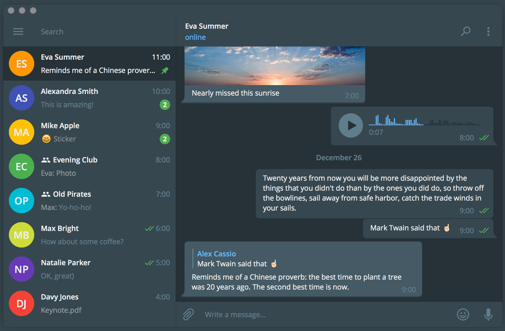

# Material Dark for Telegram Desktop

If you want **to install it, click [here](https://github.com/corsaroquad/tdesktop-material-dark/releases)!**

This theme has been written from scratch following Google's [Material palette](https://material.io/guidelines/style/color.html#color-color-palette).

Here is the chosen palette:
-  `#ECEFF1`
-  `#607D8B`
-  `#455A64`
-  `#37474F`
-  `#263238`
-  `#64B5F6`
-  `#4CAF50`
-  `#FF3D00`

**Do you want improve this theme?** Feel free to leave me a feedback, thank you!
